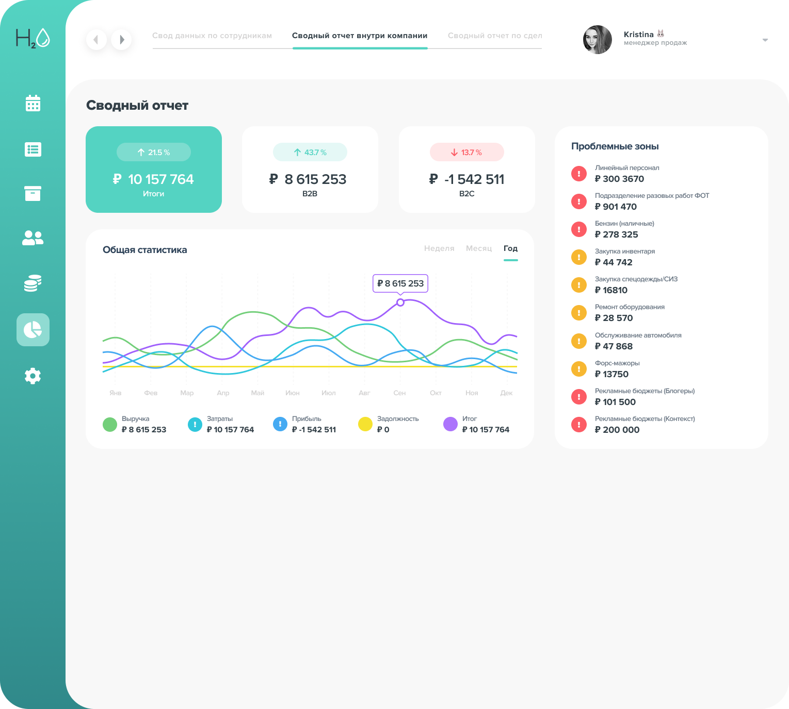

# Test task for H2O (H2O Test)

***Deadline: 4 days***

***Task:***

Create a web page layout based on a Figma design.


Main Requirements:

- Random Data Generation:
  Generate random dataset in JSON format. Example:

```
"data": [
    {
        "division": "B2B",
        "date": "2023-09-25T05:00:00.000+00:00",
        "amount": "20000",
        "type": "expenses"
    },
    {
        "division": "B2C",
        "date": "2023-09-24T05:00:00.000+00:00",
        "amount": "14000",
        "type": "income"
    }
]
```

- Chart
- Navigation & Styling
- Problem areas
- Animations